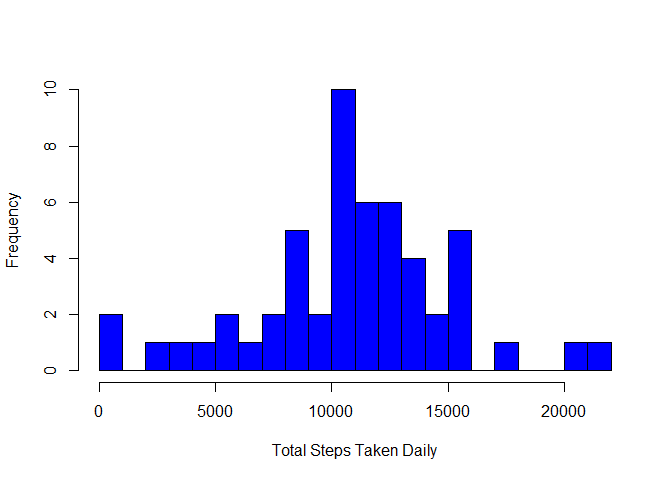
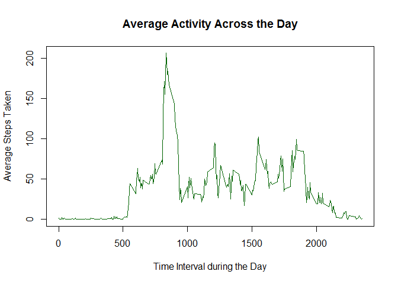
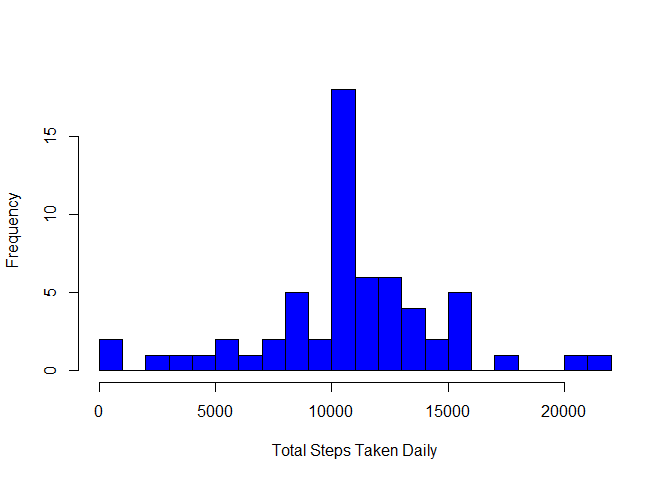
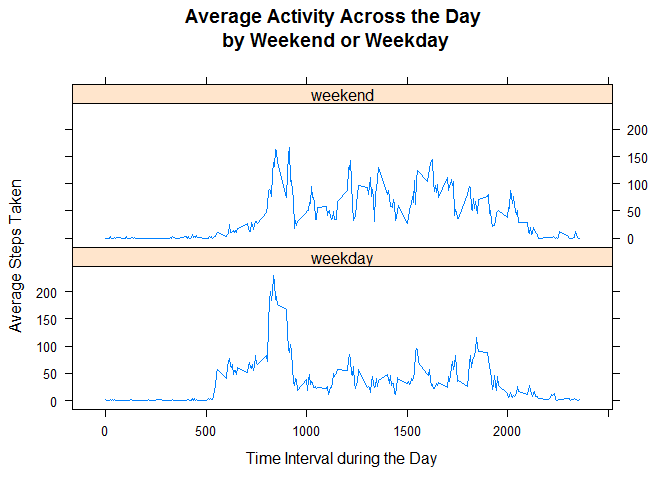

# Reproducible Research: Peer Assessment 1
Julian Farmer  
16th August 2015  
This R Markdown report investigates and analyses the data collected by personal activity monitor devices, namely the FitBit. The steps below, take the data from the .csv file through to the final conclusion, answering a number of questions.


## Loading and preprocessing the data

```r
data <- read.csv("activity.csv", colClasses = c("numeric", "Date", "numeric"))
```

## What is mean total number of steps taken per day?
The daily_steps dataset collates the total number of steps taken over each day.

```r
daily_steps <- aggregate(steps ~ date, data, sum)
```

A histogram is useful in showing the frequency and distribution of the total steps taken per day

```r
hist(daily_steps$steps, main = "", breaks = 20, col = "Blue", xlab = "Total Steps Taken Daily")
```

 

```r
mean1 <- mean(daily_steps$steps)
median1 <- median(daily_steps$steps)
```
The mean and median of the total steps taken per day are 10766.1887 and 10765 respectively.

## What is the average daily activity pattern?

```r
aver_steps_by_interval <- aggregate(steps ~ interval, data, mean)
```

The time plot below shows the average daily activity pattern, from midnight to midnight, 24 hours later.

```r
plot(aver_steps_by_interval, type = "l", col = "darkgreen",
     xlab = "Time Interval during the Day", ylab = "Average Steps Taken", 
     main = "Average Activity Across the Day")
```

 

```r
max_interval <- aver_steps_by_interval$interval[which.max(aver_steps_by_interval$steps)]
```
Not surprisingly the time interval with the highest number of steps is 8:35-8:40am, with people probably rushing to work!

## Imputing missing values

```r
num_nas <-sum(is.na(data))
```
There are 2304 missing values.

Data values can be imputed, filling in the missing values. Here, this will be done by using the corresponding 5-minute interval average.
A new dataset will be created from the original with imputed values.

```r
imputed_data <- data
for (i in 1:nrow(imputed_data)){
  if (is.na(imputed_data$steps[i])){
    imputed_data$steps[i] <- aver_steps_by_interval$steps[which(imputed_data$interval[i] == aver_steps_by_interval$interval)]
  }
}
```

A histogram can again be plotted to show the frequency and distribution of the total steps taken daily


```r
imputed_daily_steps <- aggregate(steps ~ date, imputed_data, sum)
```


```r
hist(imputed_daily_steps$steps, main = "", breaks = 20, col = "Blue", xlab = "Total Steps Taken Daily")
```

 

```r
mean2 <- mean(imputed_daily_steps$steps)
median2 <- median(imputed_daily_steps$steps)
```

The mean and median for total step taken per day can be recaluclated using the imputed data and are 10766.1887 and 10766.1887 respectively.

As it can be see the mean and median, after imputing data, have not changed dramatically, if anything the median has slightly increased to be the same as the mean.   Imputing missing data values has also increased the frequency of 10000 - 11000 total steps taken daily.

From eye-balling the histograms, the data looks close to being t-distributed, where both the mean and median are the same.

## Are there differences in activity patterns between weekdays and weekends?
Are people more active on the weekdays or the weekends?
By subsetting the data into "Weekdays" & "Weekends", this question can be answered.

```r
imputed_data$weekdays <- ifelse(weekdays(imputed_data$date) %in% c("Saturday", "Sunday"), "weekend", "weekday")
imputed_data$weekdays <- factor(imputed_data$weekdays, levels = c("weekday", "weekend"))
imputed_aver_steps_by_interval <- aggregate(steps ~ interval + weekdays, imputed_data, mean)
```


```r
library(lattice)
xyplot(steps ~ interval  | weekdays, imputed_aver_steps_by_interval, type = 'l', 
       main="Average Activity Across the Day \nby Weekend or Weekday", layout = c(1,2),
       xlab="Time Interval during the Day", ylab="Average Steps Taken")
```

 

As can be seen from the two plots, the activty profile from weekdays (Monday - Friday) are markably different from the weekend (Saturday and Sunday) profiles.

The time interval with the maximum activity occurs around 8:30am on a weekday, with the activity staying above 150 steps/5 min interval till about 9:30am. For the rest of the day (Mon-Fri), the activity is around 50 steps/5 min interval, until about 7pm, where activity spikes to 110 steps/5 min interval.  This activty profile looks like it agrees with a usual workday routine.

The weekend activty profile differs in that the activity is regular above 100 steps/5 min interval, during the day, and that the activity starts later (ie lie-in at the weekends), and finishes later (ie later to bed).

# Conclusion
By stepping along through loading, transforming, imputing and reporting data, this report concludes that the level of activity varies during the day and across the week.

This report was made using R 3.1.3 on Windows 8.1.
